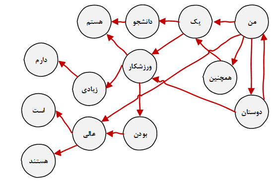

# IUST Complex Network

### About
Sample word network

### References
[1] J. Leskovec, J. Kleinberg and C. Faloutsos. Graphs over Time: Densification Laws, Shrinking Diameters and Possible Explanations. ACM SIGKDD International Conference on Knowledge Discovery and Data Mining (KDD), 2005.

[2] J. Gehrke, P. Ginsparg, J. M. Kleinberg. Overview of the 2003 KDD Cup. SIGKDD Explorations 5(2): 149-151, 2003.

[3] J. Leskovec, J. Kleinberg and C. Faloutsos. Graph Evolution: Densification and Shrinking Diameters. ACM Transactions on Knowledge Discovery from Data (ACM TKDD), 1(1), 2007.

[4] Cytoscape, “Cytoscape.” [Online]. Available: https://cytoscape.org/. [Accessed: 25-Apr-2019].

[5] NetworkX, “NetworkX.” [Online]. Available: https://networkx.github.io/. [Accessed: 26-Apr-2019].

