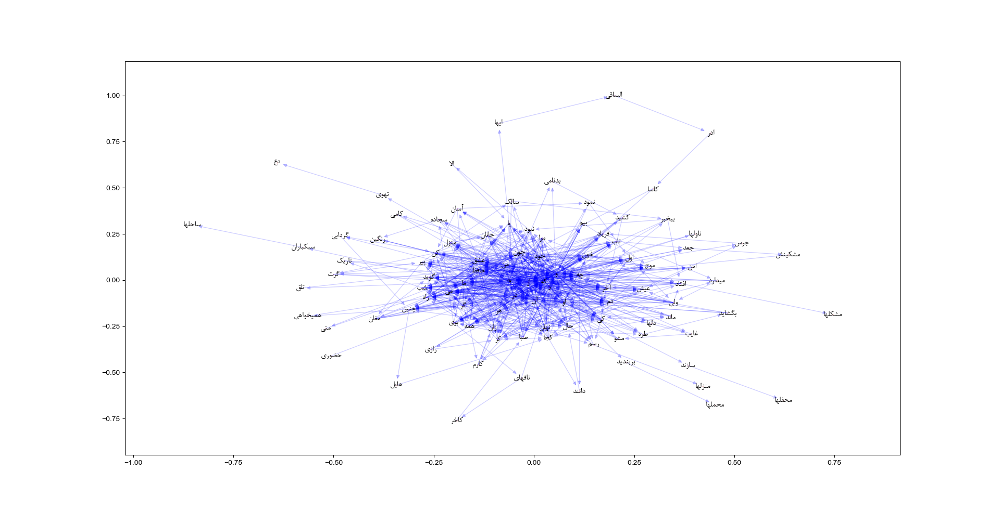
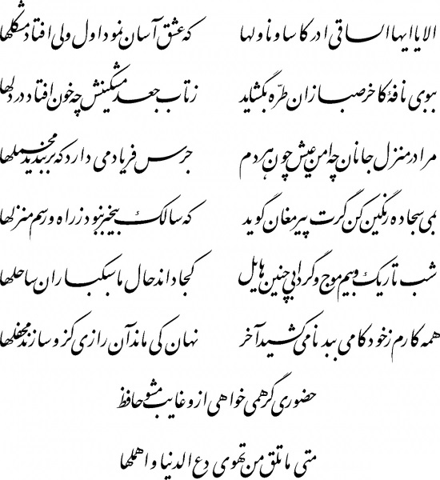
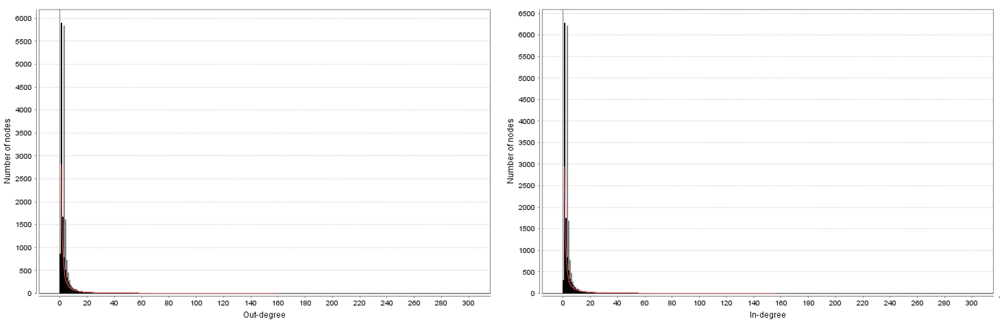
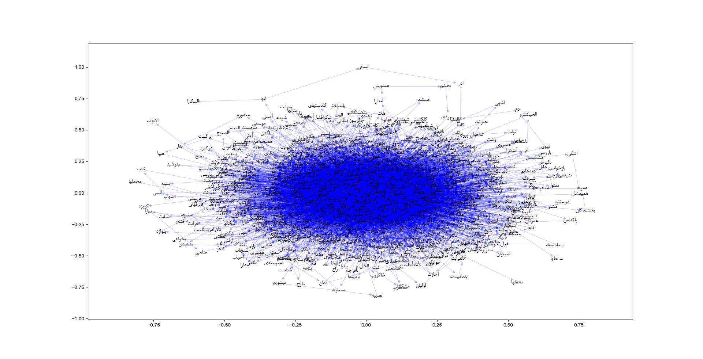

# IUST Complex Network

## Hafez (حافظ) Wordnet
We extracted a word network from _Hafez_ poems. A naive version of this network is presented here. Each word is connected to the next word in a same poetry. A subgraph cosist of first 100 nodes is shown in below figure.

The above network is based on the preamble poetry in Divan-e-Hafez

#### Degree Distrubution

#### Hafez Poems (Subgraph with 1000 Nodes)

## Network Analysis for Hafez Wordnet

### Assignment 3
1) Collect some networks
2) Compute some metrics of these networks
3) Analysis and discuss the results

### Assignment 4
Consider the three network datasets of assignment #3

1) Fit E-R, W-S, B-A, and X models to these networks
2) Select (find) X as the best fitting model
3) Generate artificial graphs similar to that networks
    * Specify the suitable generative parameters
4) Compute some macro-level metrics
    * Degree distribution, avg clustering coefficient, …
5) Compare the features of the real and artificial graph counterparts
6) Analyze the results (comparison)

### Assignment 5
Consider the three network datasets of previous assignments
1) Find communities in each network
2) Report “modularity” of the communities.

### References
[1] J. Leskovec, J. Kleinberg and C. Faloutsos. Graphs over Time: Densification Laws, Shrinking Diameters and Possible Explanations. ACM SIGKDD International Conference on Knowledge Discovery and Data Mining (KDD), 2005.

[2] J. Gehrke, P. Ginsparg, J. M. Kleinberg. Overview of the 2003 KDD Cup. SIGKDD Explorations 5(2): 149-151, 2003.

[3] J. Leskovec, J. Kleinberg and C. Faloutsos. Graph Evolution: Densification and Shrinking Diameters. ACM Transactions on Knowledge Discovery from Data (ACM TKDD), 1(1), 2007.

[4] Cytoscape, “Cytoscape.” [Online]. Available: https://cytoscape.org/. [Accessed: 25-Apr-2019].

[5] NetworkX, “NetworkX.” [Online]. Available: https://networkx.github.io/. [Accessed: 26-Apr-2019].

