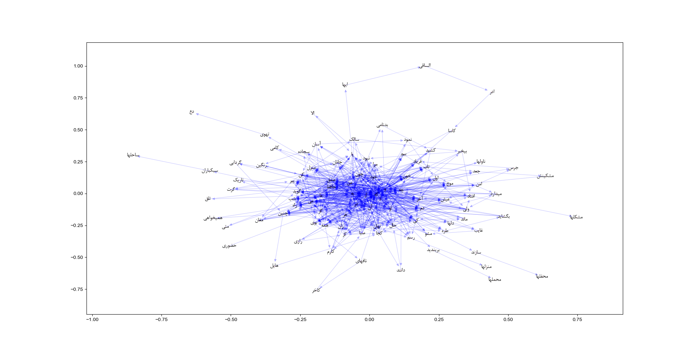
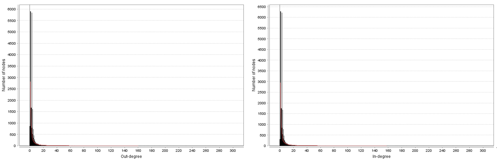
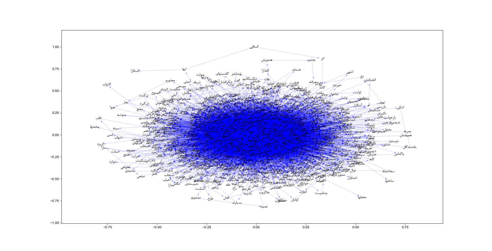
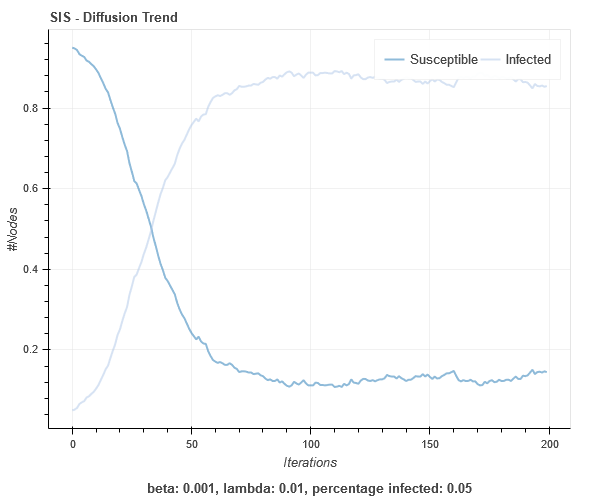

# Introduction
This repository contains my assignments and projects submitted as a requirement of IUST Dynamic Complex Network course.

## Hafez (حافظ) Wordnet
We extracted a word network from _Hafez_ poems. A naive version of this network is presented here. Each word is connected to the next word in a same poetry. A subgraph cosist of first 100 nodes is shown in below figure.

The above network is based on the preamble poetry in Divan-e-Hafez:

#### Degree Distrubution

#### Hafez Poems (Subgraph with 1000 Nodes)

## Network Analysis for Hafez Wordnet
To be complete . . .

## Assignment Details

### Assignment 3
1) Collect some networks
2) Compute some metrics of these networks
3) Analysis and discuss the results

### Assignment 4
Consider the three network datasets of assignment #3

1) Fit E-R, W-S, B-A, and X models to these networks
2) Select (find) X as the best fitting model
3) Generate artificial graphs similar to that networks
    * Specify the suitable generative parameters
4) Compute some macro-level metrics
    * Degree distribution, avg clustering coefficient, …
5) Compare the features of the real and artificial graph counterparts
6) Analyze the results (comparison)

### Assignment 5
Consider the three network datasets of previous assignments
1) Find communities in each network
2) Report “modularity” of the communities.

### Assignment 6
Simulate two epidemic models on two network models
1) Four simulation scenarios
    * E.g., SIRS epidemic model on BA network model

The importance of epidemy models is obvious in cases such as **COVID-19** pandemic. Here we are going to perform some epidemics simulation on different graph models and depicting the result. 

#### SIR on Barabasi-Albert graph    

#### SIS on Barabasi-Albert graph    

## References
[1] J. Leskovec, J. Kleinberg and C. Faloutsos. Graphs over Time: Densification Laws, Shrinking Diameters and Possible Explanations. ACM SIGKDD International Conference on Knowledge Discovery and Data Mining (KDD), 2005.

[2] J. Gehrke, P. Ginsparg, J. M. Kleinberg. Overview of the 2003 KDD Cup. SIGKDD Explorations 5(2): 149-151, 2003.

[3] J. Leskovec, J. Kleinberg and C. Faloutsos. Graph Evolution: Densification and Shrinking Diameters. ACM Transactions on Knowledge Discovery from Data (ACM TKDD), 1(1), 2007.

[4] Cytoscape, “Cytoscape.” [Online]. Available: https://cytoscape.org/. [Accessed: 25-Apr-2019].

[5] NetworkX, “NetworkX.” [Online]. Available: https://networkx.github.io/. [Accessed: 26-Apr-2019].

[6] M. E. J Newman 'Networks: An Introduction', page 224, Oxford University Press 2011.

[7] Clauset, A., Newman, M. E., & Moore, C. "Finding community structure in very large networks." Physical Review E 70(6), 2004.

[8]	U. of Graz, “A (partially) interactive introduction to systems sciences.” [Online]. Available: http://systems-sciences.uni-graz.at/etextbook/networks/sirnetwork.html. [Accessed: 02-Jun-2019].

[9]	G. Rossetti, L. Milli, S. Rinzivillo, A. Sirbu, F. Giannotti, and D. Pedreschi, “NDlib: a python library to model and analyze diffusion processes over complex networks,” CoRR, vol. abs/1801.0, 2018.

[10]	NetworkX, “NetworkX.” [Online]. Available: https://networkx.github.io/. [Accessed: 26-Apr-2019].

[11]	J. Banks and J. S. Carson, “Introduction to discrete-event simulation,” 2003, pp. 17–23.

***